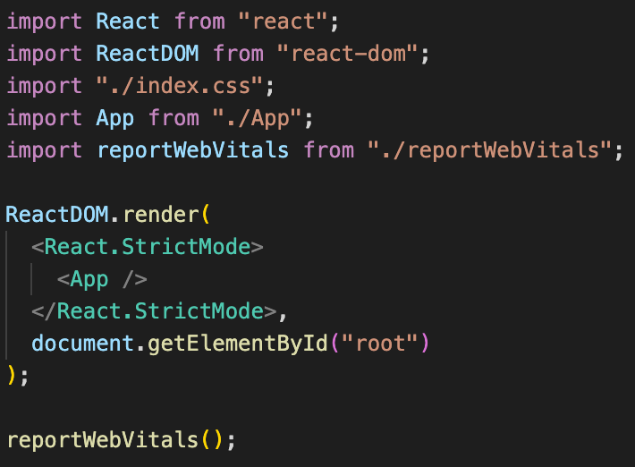

# 📍 리액트 환경에서 카카오 지도 API 사용하기

> <a href="https://velog.io/@dndb3599/%EC%B9%B4%EC%B9%B4%EC%98%A4%EB%A7%B5-API1-React%EB%A1%9C-%EC%B9%B4%EC%B9%B4%EC%98%A4%EB%A7%B5-%EA%B5%AC%ED%98%84%ED%95%98%EA%B8%B0">참고 자료 1</a>, 출처 : velog, [카카오맵 API#1] React로 카카오맵 구현하기 <br/> > <a href="https://apis.map.kakao.com/web/wizard/">참고자료 2</a>, 출처 : 카카오 MAPS, API WIZARD

## 🎯 들어가기 앞서

<p>이번 프로젝트에서는 지도 API를 바탕으로 사용자에 의해 정보를 입력 받아 결과물을 DB에 저장하고 이를 보여주는 흐름을 가지기로 했다.</p>
<p>따라서 html이 아닌, CRA 환경에서 지도 API를 적용해 본 경험이 없어, 이를 적용해보기 이 레포지토리를 생성하였다. </p>

## 🎯 1. 리액트의 특징, 폴더 구조



<p>리액트는 build 과정을 거쳐, 다수의 파일에서 하나의 파일로 번들링 된 페이지가 public/index.html에서 렌더링 된다. 그에 따라서 &ltscript&gt...&lt/script&gt 파일은 index.html에 삽입해줘야 한다.</p>

> 해당 코드는 다음과 같다.

```
<!DOCTYPE html>
<html lang="en">
  <head>
    <meta charset="utf-8" />
    <link rel="icon" href="%PUBLIC_URL%/favicon.ico" />
    <meta name="viewport" content="width=device-width, initial-scale=1" />
    <meta name="theme-color" content="#000000" />
    <meta
      name="description"
      content="Web site created using create-react-app"
    />
    <link rel="apple-touch-icon" href="%PUBLIC_URL%/logo192.png" />
    <link rel="manifest" href="%PUBLIC_URL%/manifest.json" />
    <title>React App</title>
  </head>
  <body>
    <div id="root">
      <script type="text/javascript" src="//dapi.kakao.com/v2/maps/sdk.js?appkey=발급받은_api_key"></script>
    </div>
  </body>
</html>

```

```js
document.getElementById("root");
```

<p>'root' 를 통해  &ltdiv&gt ... &lt/div&gt 사이에 값이 렌더링되므로 kakao api에서 발급 받은 JAVASCRIPT KEY를 포함한 스크립트 태그를 넣어준다.</p>

## 🎯 2. 렌더링하기

```js
📁src/App.js

import "./App.css";
import Map from "./Map";

function App() {
  return <Map />;
}

export default App;
```

<p>기본적으로 App에 모두 때려 박아도 상관없지만, App은 최대한 가볍게 유지하는 것이 좋다.(구조 상 최 상위 컴포넌트만을 렌더링해주는 것이 좋다.) 따라서, Map이라는 컴포넌트를 생성하여 이를 App.js에서 사용하였다.</p>

> Map 컴포넌트는 다음과 같다.

```js
📁src/Map.js

import React, { useEffect } from "react";
import KakaoMapScript from "./KaKaoMapScript";

export default function Map() {
  useEffect(() => {
    KakaoMapScript();
  }, []); // 마운트 될때 사용할수 있도록 useEffect 사용

  return (
    <div
      id="myMap"
      style={{
        width: "100vw",
        height: "100vh",
      }}
    ></div>
  );
}
```

<p>기존처럼 프레젠테이셔널 컴포넌트와 컨테이너 컴포넌트의 경계는 많이 무뎌졌지만, 최대한 해당 페이지가 본연의 기능만 할 수 있도록 만들어 주는 것이 좋다. 따라서, KakaoMapScript 함수를 모듈화하여서 분리하였다.</p>

<p>또한 useEffect() 훅 함수로 해당 함수를 감싸주어 처음 렌더링 시에 해당 함수를 불러올 수 있도록 만들어 주었다.</p>

> export한 KakaoMapScript() 함수의 코드는 다음과 같다.

```js
📁src/KaKaoMapScript.js

const { kakao } = window; // 이걸 해줘야 카카오 api 에서 사용하는 변수들을 리엑트가 알 수 있다.

export default function KakaoMapScript() {
  const container = document.getElementById("myMap"); // 가이드는 Map이다
  const options = {
    center: new kakao.maps.LatLng(33.450701, 126.570667),
    level: 3,
  };
  const map = new kakao.maps.Map(container, options);

  // HTML5의 geolocation으로 사용할 수 있는지 확인합니다
  if (navigator.geolocation) {
    // GeoLocation을 이용해서 접속 위치를 얻어옵니다
    navigator.geolocation.getCurrentPosition(function (position) {
      var lat = position.coords.latitude, // 위도
        lon = position.coords.longitude; // 경도

      var locPosition = new kakao.maps.LatLng(lat, lon), // 마커가 표시될 위치를 geolocation으로 얻어온 좌표로 생성합니다
        message = '<div style="padding:5px;">여기에 계신가요?!</div>'; // 인포윈도우에 표시될 내용입니다

      // 마커와 인포윈도우를 표시합니다
      displayMarker(locPosition, message);
    });
  } else {
    // HTML5의 GeoLocation을 사용할 수 없을때 마커 표시 위치와 인포윈도우 내용을 설정합니다

    var locPosition = new kakao.maps.LatLng(33.450701, 126.570667),
      message = "geolocation을 사용할수 없어요..";

    displayMarker(locPosition, message);
  }
  // 지도에 마커와 인포윈도우를 표시하는 함수입니다
  function displayMarker(locPosition, message) {
    // 마커를 생성합니다
    var marker = new kakao.maps.Marker({
      map: map,
      position: locPosition,
    });

    var iwContent = message, // 인포윈도우에 표시할 내용
      iwRemoveable = true;

    // 인포윈도우를 생성합니다
    var infowindow = new kakao.maps.InfoWindow({
      content: iwContent,
      removable: iwRemoveable,
    });

    // 인포윈도우를 마커위에 표시합니다
    infowindow.open(map, marker);

    // 지도 중심좌표를 접속위치로 변경합니다
    map.setCenter(locPosition);
  }

  // 지도에 확대 축소 컨트롤을 생성한다
  var zoomControl = new kakao.maps.ZoomControl();

  // 지도의 우측에 확대 축소 컨트롤을 추가한다
  map.addControl(zoomControl, kakao.maps.ControlPosition.RIGHT);
}

```

<p>제일 중요한 부분은 </p>

```js
const { kakako } = window;
```

<p>윈도우 객체에서 카카오를 참조하는 부분이다. 📁 public/index.html을 통해 윈도우 객체에 설정된 kakao를 react 내부에서 사용할 수 있도록 설정해주는 것이다.</p>

<p>다른 부분들은 <a href="https://apis.map.kakao.com/web/wizard/">kakao maps api</a>에서 제공해주기 때문에 입맛에 맞게 추가하여 사용하면 된다.</p>
